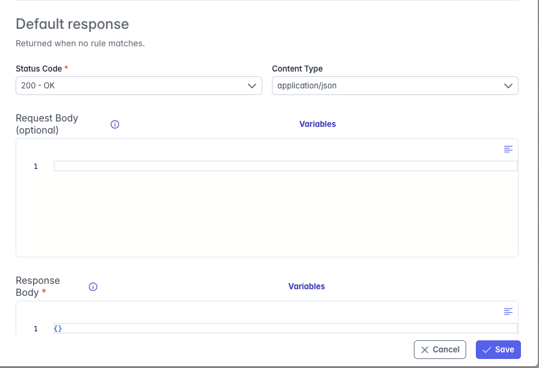
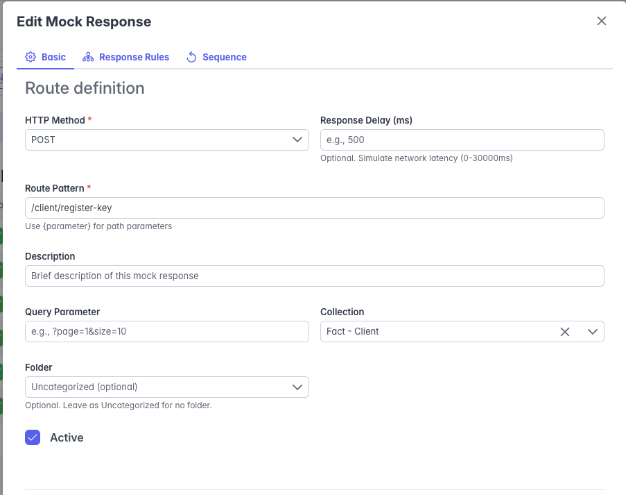
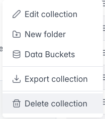
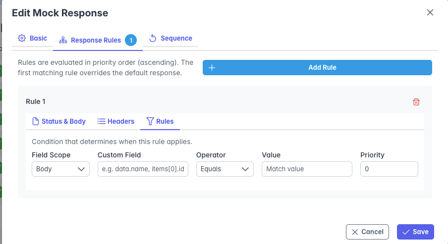
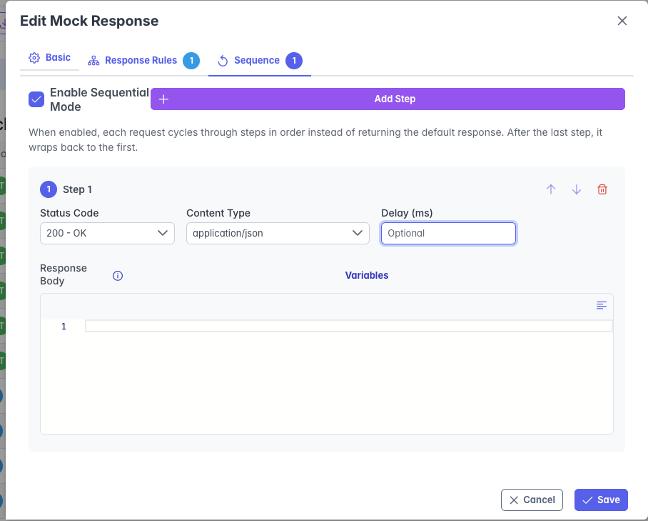
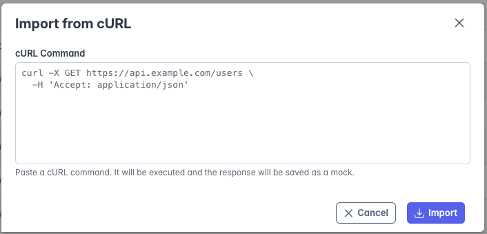
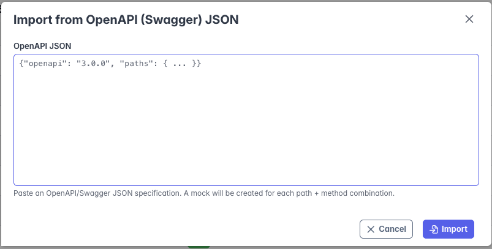
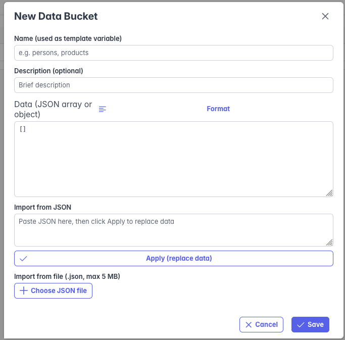
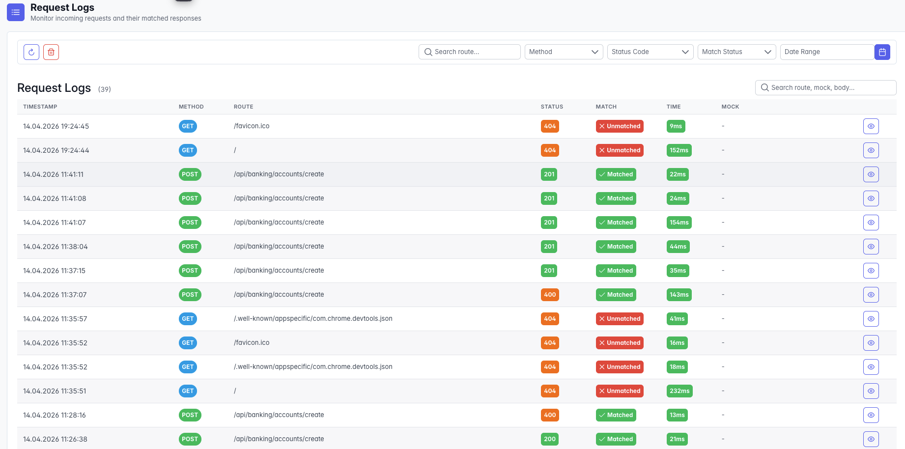

# Mocklab User Guide

Mocklab is a lightweight API mocking platform for teams that need realistic HTTP endpoints without waiting for backend completion. It helps developers, QA engineers, product teams, and solution architects simulate APIs, test edge cases, and demonstrate flows from a clean browser-based interface.

## Why Mocklab

Mocklab is designed for teams that want to:

- unblock frontend and mobile development before real services are ready
- simulate happy paths, failures, retries, and latency without custom stub code
- organize large sets of mocks by product area, domain, or project
- import existing API definitions instead of creating mocks one by one
- observe request traffic and diagnose why a request did or did not match

## What You Can Do

| Capability | What it helps with |
|---|---|
| Mock any HTTP endpoint | Create responses for `GET`, `POST`, `PUT`, `DELETE`, `PATCH`, `HEAD`, and `OPTIONS` |
| Manage mocks visually | Create, edit, activate, deactivate, duplicate, or delete mocks from the admin UI |
| Organize by collections | Group related mocks and move faster in larger environments |
| Import from cURL or OpenAPI | Bootstrap mocks from existing API contracts |
| Return conditional responses | Send different responses based on headers, query parameters, route values, method, cookies, or body fields |
| Simulate stateful flows | Use sequential responses to model retries, queue processing, or progressive states |
| Generate dynamic payloads | Build realistic responses with Scriban templates, request context, and helper functions |
| Reuse dataset-driven content | Store JSON data in data buckets and use it inside templates |
| Add response delays | Reproduce slow networks, timeout handling, and loading states |
| Inspect request activity | Review matched and unmatched traffic in request logs |

## Product Tour

### Mock Management

The Mock Management screen is the main workspace for creating and maintaining mock endpoints. Users can define route, method, status code, response body, activation state, and grouping from a single page.



After a mock is created, it can be refined with richer payloads, descriptions, delays, or updated route settings.



### Quick Actions

Each mock includes a context menu for common operations such as editing, toggling active state, or removing entries. This keeps repetitive maintenance tasks fast when working with many endpoints.



### Conditional Rules

Rules let one endpoint behave differently depending on the incoming request. This is useful for authorization scenarios, validation errors, feature flags, tenant-specific behavior, or request-shape-based responses.

Typical examples:

- return `401` when an authorization header is missing
- return `422` when a body field contains an unsupported value
- return a different response when a query parameter changes



### Sequential Responses

Sequential mode makes the same endpoint respond differently on each request in order. This is ideal for retry testing, progress-state simulations, rate-limiting scenarios, and step-based workflows.

Examples include:

- first call fails, second call retries, third call succeeds
- first two calls return `200`, third call returns `429`
- asynchronous job states move from `pending` to `processing` to `completed`



### Import Existing APIs

Mocklab can create mocks from source material your team already has. This reduces manual setup and accelerates onboarding for new services.

Import from a raw cURL command:



Import from an OpenAPI or Swagger document:



### Data Buckets

Data buckets are reusable JSON datasets attached to collections. They are useful when you want templates to pull from realistic lists such as customers, accounts, products, or addresses.

This is especially valuable for:

- demo environments with richer sample data
- repeated test execution with randomized but structured responses
- keeping response templates concise while centralizing shared data



### Request Logs

Every incoming request can be inspected from the Request Logs screen. This helps teams understand whether a request matched a mock, what payload arrived, how long the response took, and where debugging should start.

Request logs are especially useful when:

- a consumer receives `404` and you need to see what path was actually sent
- a mock exists but the method, query string, or body does not match
- you want to validate traffic patterns during manual or automated testing



## Dynamic Templates and Helpers

Mocklab supports dynamic templating in response bodies and in rule-based responses. This makes it possible to return realistic payloads, echo request data, generate randomized fields, and build more lifelike demo or test scenarios without writing custom code.

### Where Templates Can Be Used

Templates are especially useful in these areas:

- default mock response bodies
- rule-based response bodies
- rule-specific response values when a matching rule is returned
- collection-based datasets used by templates through data buckets

### Template Syntax

Mocklab uses Scriban syntax. You can use simple expressions or full control-flow blocks:

```json
{
  "id": "{{ helpers.guid() }}",
  "status": "{{ random_status }}"
}
```

```json
{
  "items": [
    {{ for i in 0..2 }}
      { "id": "{{ helpers.guid() }}", "amount": {{ helpers.rand_int(10, 500) }} }{{ if !for.last }},{{ end }}
    {{ end }}
  ]
}
```

Supported patterns include:

- `{{ expression }}` for inline output
- `{{ if condition }} ... {{ else }} ... {{ end }}`
- `{{ for x in items }} ... {{ end }}`

Legacy placeholders are still supported and automatically normalized. For example:

- `{{$randomUUID}}` becomes `{{ guid }}`
- `{{$request.path}}` becomes `{{ request.path }}`
- `{{$request.header.X-Correlation-Id}}` becomes `{{ request.headers["X-Correlation-Id"] }}`

### Request-Aware Expressions

Templates can read values from the incoming request and build dynamic responses around them.

| Expression | Description |
|---|---|
| `{{ request.method }}` | Current HTTP method |
| `{{ request.path }}` | Request path |
| `{{ request.body }}` | Parsed JSON body when valid JSON, otherwise raw content |
| `{{ request.body.accountName }}` | Field from a JSON request body |
| `{{ request.body.user.name }}` | Nested JSON field |
| `{{ request.body_raw }}` | Always the raw body string |
| `{{ request.json }}` | Alias for parsed JSON body |
| `{{ request.query.page }}` | Query parameter by name |
| `{{ request.query["tier"] }}` | Query parameter using bracket syntax |
| `{{ request.headers["Authorization"] }}` | Request header |
| `{{ request.cookies.sessionId }}` | Cookie value |
| `{{ request.route.id }}` | Route parameter from a template route such as `/api/users/{id}` |
| `{{ headers["x-correlation-id"] }}` | Top-level case-insensitive header access |

Example:

```json
{
  "requestId": "{{ helpers.guid() }}",
  "path": "{{ request.path }}",
  "accountName": "{{ upper request.body.accountName }}",
  "tier": "{{ request.query["tier"] }}",
  "userId": "{{ request.route.id }}"
}
```

### Core Helper Methods

For common random and string-generation needs, Mocklab exposes a helper namespace:

| Helper | Description |
|---|---|
| `{{ helpers.guid() }}` | Random UUID |
| `{{ helpers.rand_int(1, 100) }}` | Random integer within a range |
| `{{ helpers.alphanum(12) }}` | Random alphanumeric string |
| `{{ helpers.username() }}` | Generated username such as `fast_tiger42` |
| `{{ helpers.email() }}` | Generated email using `example.com` |
| `{{ helpers.email("my.domain.com") }}` | Generated email with custom domain |

Additional top-level utility expressions are also available:

| Expression | Description |
|---|---|
| `{{ random_int }}` or `{{ random_int 18 65 }}` | Random integer with optional range |
| `{{ random_float }}` | Random float |
| `{{ random_double 1 99 }}` | Random double in a custom range |
| `{{ random_name }}` | Random full name |
| `{{ random_first_name }}` | Random first name |
| `{{ random_last_name }}` | Random last name |
| `{{ random_email }}` | Random email address |
| `{{ random_phone }}` | Random phone number |
| `{{ random_bool }}` | Random boolean |
| `{{ random_string 8 }}` | Random string of length 8 |
| `{{ random_string 8 "ABC123" }}` | Random string from a custom character set |
| `{{ random_alpha_numeric 10 }}` | Random alphanumeric string |
| `{{ random_number_string 6 }}` | Random numeric string |
| `{{ upper "hello" }}` | Uppercase conversion |
| `{{ lower "HELLO" }}` | Lowercase conversion |
| `{{ timestamp }}` | Unix timestamp |
| `{{ iso_timestamp }}` | ISO 8601 UTC timestamp |
| `{{ now }}` | Current UTC date-time object (use inside `date_time_add` / `date_time_add_fmt`) |
| `{{ now_fmt 'yyyy-MM-dd' }}` | Current date as a formatted string |
| `{{ now_fmt 'yyyy-MM-ddTHH:mm:ss' }}` | Current date-time as a formatted string |

### Arithmetic Helpers

Arithmetic helpers follow  helper convention: the operator comes first, then the two operands. Operands can be literals or nested expressions such as `body "fieldName"`.

| Expression | Description |
|---|---|
| `{{ add 10 5 }}` | Addition → `15` |
| `{{ subtract 10 3 }}` | Subtraction → `7` |
| `{{ subtract 3 (body 'retryCount') }}` | Subtract a body field from a literal |
| `{{ multiply 4 2.5 }}` | Multiplication → `10` |
| `{{ divide 10 4 }}` | Division → `2.5` |

### Date and Time Helpers

`date_time_add` shifts a date-time by a given amount and unit. Supported units: `years`, `months`, `weeks`, `days`, `hours`, `minutes`, `seconds`. Use `date_format` to convert the result to a string.

| Expression | Description |
|---|---|
| `{{ now_fmt 'yyyy-MM-dd' }}` | Today as a formatted date string |
| `{{ date_time_add (now) 1 'days' }}` | Tomorrow as an ISO 8601 string |
| `{{ date_time_add (now) -7 'days' }}` | Seven days ago as an ISO 8601 string |
| `{{ date_time_add (now) 3 'months' }}` | Three months from now as an ISO 8601 string |
| `{{ date_time_add_fmt (now) 1 'days' 'yyyy-MM-dd' }}` | Tomorrow formatted as `yyyy-MM-dd` |
| `{{ date_time_add_fmt (now) 30 'days' 'yyyy-MM-dd' }}` | 30 days from now formatted |
| `{{ date_time_add_fmt (now) 1 'months' 'yyyy-MM-dd HH:mm' }}` | One month from now with time |
| `{{ date_format (now) 'yyyy-MM-dd' }}` | Format the current DateTime object |

Use `date_time_add_fmt` when you need a shifted date as a formatted string. Use `date_time_add` when ISO 8601 output is sufficient. Use `now_fmt` to format the current time without any shift.

Example:

```json
{
  "issuedAt": "{{ now_fmt 'yyyy-MM-dd' }}",
  "expiresAt": "{{ date_time_add_fmt (now) 30 'days' 'yyyy-MM-dd' }}"
}
```

### Faker Helper

The `faker` helper follows convention and accepts a dotted category string followed by optional arguments. This makes it straightforward to migrate templates.

| Expression | Description |
|---|---|
| `{{ faker 'number.int' 1 100 }}` | Random integer between 1 and 100 |
| `{{ faker 'number.float' 0.5 5.0 2 }}` | Random float in [0.5, 5.0] with 2 decimal places |
| `{{ faker 'person.firstName' }}` | Random first name |
| `{{ faker 'person.lastName' }}` | Random last name |
| `{{ faker 'person.fullName' }}` | Random full name |
| `{{ faker 'internet.email' }}` | Random email address |
| `{{ faker 'internet.url' }}` | Random URL |
| `{{ faker 'internet.ip' }}` | Random IP address |
| `{{ faker 'internet.color' }}` | Random hex color |
| `{{ faker 'location.city' }}` | Random city |
| `{{ faker 'location.country' }}` | Random country |
| `{{ faker 'location.latitude' }}` | Random latitude |
| `{{ faker 'location.longitude' }}` | Random longitude |
| `{{ faker 'location.zipCode' }}` | Random zip code |
| `{{ faker 'location.streetAddress' }}` | Random street address |
| `{{ faker 'finance.iban' }}` | Random IBAN |
| `{{ faker 'finance.bic' }}` | Random BIC/SWIFT code |
| `{{ faker 'finance.currencyCode' }}` | Random currency code |
| `{{ faker 'finance.creditCardNumber' }}` | Random Luhn-valid card number |
| `{{ faker 'finance.amount' }}` | Random price |
| `{{ faker 'company.name' }}` | Random company name |
| `{{ faker 'date.future' }}` | Random future date (ISO 8601) |
| `{{ faker 'date.past' }}` | Random past date (ISO 8601) |
| `{{ faker 'date.birthdate' }}` | Random birthdate |
| `{{ faker 'string.uuid' }}` | Random UUID |
| `{{ faker 'lorem.word' }}` | Random word |
| `{{ faker 'phone.number' }}` | Random phone number |
| `{{ faker 'system.mimeType' }}` | Random MIME type |
| `{{ faker 'system.fileExt' }}` | Random file extension |

### Body Shorthand

The `body` helper is reads a single top-level field from the incoming JSON body. It is especially useful when combined with arithmetic helpers.

| Expression | Description |
|---|---|
| `{{ body 'fieldName' }}` | Read a top-level field from the JSON request body |
| `{{ subtract 3 (body 'retryCount') }}` | Subtract a body field value from a literal |
| `{{ add (body 'quantity') (body 'bonus') }}` | Add two body fields together |

This is functionally equivalent to `{{ request.body.fieldName }}` but reads more naturally inside arithmetic expressions.

### Pre-Generated Domain Data

When you need richer sample payloads, Mocklab includes many ready-made data generators. These can be used directly as top-level expressions like `{{ random_city }}` and are also available under `helpers.*` if you prefer a namespaced style.

#### Location and Identity

- `{{ random_company_name }}`
- `{{ random_city }}`
- `{{ random_country }}`
- `{{ random_address }}`
- `{{ random_zip_code }}`
- `{{ random_continent }}`
- `{{ random_timezone }}`
- `{{ random_latitude }}`
- `{{ random_longitude }}`
- `{{ random_language_code }}`

#### People and Access

- `{{ random_job_title }}`
- `{{ random_department }}`
- `{{ random_username }}`
- `{{ random_password }}`
- `{{ random_age }}`
- `{{ random_birthdate }}`
- `{{ random_role }}`

#### Finance and Commerce

- `{{ random_currency_code }}`
- `{{ random_iban }}`
- `{{ random_account_number }}`
- `{{ random_swift_code }}`
- `{{ random_credit_card_number }}`
- `{{ random_price }}`
- `{{ random_stock_symbol }}`
- `{{ random_transaction_type }}`
- `{{ random_product_name }}`

#### Business and Workflow

- `{{ random_category }}`
- `{{ random_status }}`
- `{{ random_priority }}`
- `{{ random_order_status }}`
- `{{ random_ticket_status }}`

#### System and Technical Data

- `{{ random_ip }}`
- `{{ random_mac_address }}`
- `{{ random_url }}`
- `{{ random_http_status_code }}`
- `{{ random_color }}`
- `{{ random_hex_color }}`
- `{{ random_file_extension }}`
- `{{ random_mime_type }}`

### Data Buckets

Data buckets let you store reusable JSON inside a collection and reference it from templates. This is useful for richer demo datasets and more realistic response bodies.

Examples:

```json
{
  "customer": "{{ random_item("customers").name }}",
  "city": "{{ random_item("customers").address.city }}"
}
```

You can also access bucket content directly:

```json
{
  "firstCustomer": "{{ customers[0].name }}"
}
```

### Response Example

The example below combines request values, helpers, and pre-generated content in a default response body:

```json
{
  "requestId": "{{ helpers.guid() }}",
  "customerId": "{{ request.route.id }}",
  "customerName": "{{ request.body.name }}",
  "accountManager": "{{ random_name }}",
  "accountStatus": "{{ random_status }}",
  "preferredLanguage": "{{ random_language_code }}",
  "registeredAt": "{{ iso_timestamp }}"
}
```

### Rule Response Example

Rules can use the same template capabilities to produce more contextual responses. For example, a rule that matches premium traffic could return:

```json
{
  "tier": "{{ request.query["tier"] }}",
  "priority": "{{ random_priority }}",
  "campaignCode": "{{ helpers.alphanum(8) }}",
  "message": "Premium flow activated for {{ request.headers["X-Customer-Id"] }}"
}
```

This allows a single route to return different dynamic payloads depending on which rule is matched.

## Common Use Cases

### Frontend and Mobile Development

Build screens and flows without waiting for backend delivery. Product teams can validate journeys earlier while developers keep contracts stable.

### QA and Integration Testing

Create deterministic test scenarios for error handling, retries, partial failures, slow responses, and edge-case payloads.

### Demos and Pre-Sales Environments

Show realistic API-driven experiences with curated sample data and predictable outcomes.

### Backend Contract Prototyping

Explore how an API should behave before implementation, then evolve mocks into formal contracts.

## Suggested Adoption Flow

1. Create a collection for a product area or service domain.
2. Import existing endpoints from cURL or OpenAPI when possible.
3. Add default responses for primary success scenarios.
4. Enrich critical endpoints with rules, templates, delays, or sequences.
5. Store reusable datasets in data buckets.
6. Validate consumer behavior by reviewing request logs.

## Next Steps

- Start with the local setup guide in [Getting Started](getting-started.md)
- See [Integration Guide](integration.md) to embed Mocklab into an ASP.NET Core application
- Review [API Reference](api-reference.md) for endpoint-level details and payload models
- Use [Docker](docker.md) if you want to run Mocklab in a containerized environment
